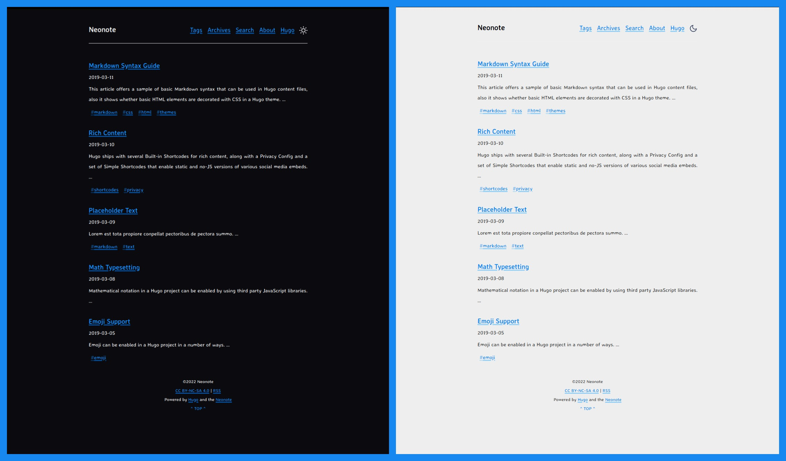

<div align = "center">

<h1><a href="https://2kabhishek.github.io/neonote">Neonote</a></h1>

<a href="https://github.com/2KAbhishek/neonote/blob/main/LICENSE">
 </a>

<a href="https://github.com/2KAbhishek/neonote/pulse">
 </a>

<a href="https://github.com/2KAbhishek/neonote/stargazers">
</a>

<a href="https://github.com/2KAbhishek/neonote/network/members">
 </a>

<a href="https://github.com/2KAbhishek/neonote/watchers">
 </a>

<a href="https://github.com/2KAbhishek/neonote/graphs/contributors">
 </a>

<a href="https://github.com/2KAbhishek?tab=followers">
 </a>

<h3>Hugo Theme for Minimalists 🎨✒️</h3>

<figure>
  
  <br/>
  <figcaption>neonote screenshot</figcaption>
</figure>

</div>

## What is this

A minimalist theme for [Hugo](https://gohugo.io) based on [hugo-notepadium](https://github.com/cntrump/hugo-notepadium).

* [Features](#features)
  * [Difference from original notepadium theme](#different-from-original-notepadium-theme)
  * [Other features](#other-features)
* [Get start](#get-start)
  * [Option 1](#option-1)
  * [Option 2](#option-2)
* [Configure theme](#configure-theme)
* [Update theme](#update-theme)
* [Customize theme](#customize-theme)

## Inspiration

I needed a theme for my blog, that's all :)

## Features

### Difference from original notepadium theme

* grid layout ([Can I use grid?](https://caniuse.com/?search=grid))
* tags cloud
* toc
* preconnect and prefetch for resourses
* inline critical css
* [hugo modules](https://gohugo.io/categories/hugo-modules)
* archive page
* light & dark theme toggle button
* search in site (powered by [stork](https://github.com/jameslittle230/stork))
* more useful Hugo shortcodes
  * tips blocks(alert messages)
  * plist for simple table in markdown

### Other features

* Logo
* Navigation items
* Syntax highlighting
* Math supporting
* Pagination with large number of pages supporting
* Light & Dark
* Custom CSS supporting
* Custom JS supporting
* Custom header right items supporting

## Get started

There are two ways to use this theme for Hugo site.

### Option 1

Use Hugo modules. Hugo Modules is powered by Go Modules. If you have installed [Go](https://golang.org/), this option is **recommended**. More details can be found in [Hugo Docs](https://gohugo.io/hugo-modules/use-modules/)

1. Initialize the hugo module system in your site root:

```bash
hugo mod init github.com/<your_user>/<your_project>
```

2. Import the theme in your config.toml:

```toml
[module]
  [[module.imports]]
    path = "github.com/2kabhishek/neonote"
```

### Option 2

Use git submodule.

1. Add theme repository as git submodule

```bash
git submodule add https://github.com/2kabhishek/neonote.git themes/neonote
```

2. Set theme in your config.toml

```toml
theme = "neonote"
```

## Configure theme

Almost everything can be configured in the `config.toml` file of your site. If you want to modify the theme, you could go to [Customize theme](#customize-theme)

Check the [example-config.toml](./example-config.toml) file for more details.

## Update theme

If you installed the theme by Hugo module

```bash
hugo mod get -u  # This will update all modules
hugo mod get -u github.com/2kabhishek/neonote  # This will update current theme
```

If you installed the theme by git submodule, first go to the theme directory, then `git pull`

```bash
cd themes/neonote && git pull
```

## More Info

* [**hugo-notepadium**](https://github.com/cntrump/hugo-notepadium)
* [**hugo-notepadium-mod**](https://github.com/qdzhang/hugo-notepadium-mod)
* [**MathJax**](https://www.mathjax.org/)
* [**Katex**](https://katex.org/)
* [**Stork**](https://github.com/jameslittle230/stork)

<div align="center">

<a href="https://github.com/2KAbhishek/neonote">Source</a> | <a href="https://2kabhishek.github.io/neonote">Website</a>

</div>
